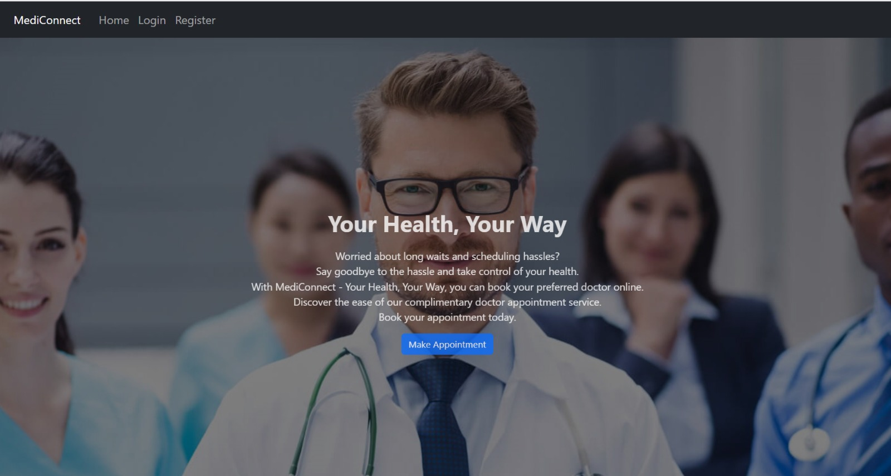

## Project Overview: Mediconnect

### Overview

Mediconnect is a web application designed to streamline the appointment booking process for patients, provide doctors with a clear view of their schedules, and empower administrators to manage appointments efficiently. The application encompasses key features for account management, appointment scheduling, and all CRUD operations.

### Features by User Role

#### Patient Features:

1. Account Creation:
   - Patients can create accounts with essential information such as name, contact details, and medical history.

2. Sign In/Sign Out:
   - Secure authentication for users to sign in and out.

3. Appointment Booking:
   - View available sessions or time slots.
   - Select and book appointments with preferred doctors.

4. Cancel Appointments:
   - Ability for patients to cancel booked appointments.

5. View Appointment History:
   - Access to a history of past appointments.

6. Profile Management:
   - Update personal information and medical history.

#### Doctor Features:

1. Account Creation:
   - Doctors can create accounts with professional information.

2. Sign In/Sign Out:
   - Secure authentication for doctors to access the system.

3. View Appointments:
   - Doctors can view upcoming appointments and patient details.

4. Availability Management:
   - Set and update availability for appointments.

5. Profile Management:
   - Update professional information and specialties.

#### Admin Features:

1. Account Creation:
   - Separate authentication system for administrators.

2. Doctor Assignment:
   - Assign doctors to available time slots or manage doctor-patient relationships.

3. Appointment Management:
   - View, modify, or cancel operations as needed.

4. User Management:
   - Manage patient and doctor accounts.

5. Reports and Analytics:
   - Generate reports on appointments, doctor availability, and other relevant data.

### Common Features:

1. Search Functionality:
   - Enable patients to search for doctors based on specialties, availability, or location.

2. Responsive Design:
   - Ensure the web app is accessible and user-friendly on various devices.

## Getting Started

Admin Portal login:
email - admin@mediconnect.com
password - password1

Doctor Portal login:
email - doctor1@mediconnect.com
password - doctorpassword1

Patient Portal login:
email - patient1@gmail.com
password - patientpassword1

Deployed URL: https://phplaravel-1182355-4150109.cloudwaysapps.com/

## Demo

